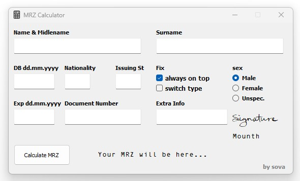
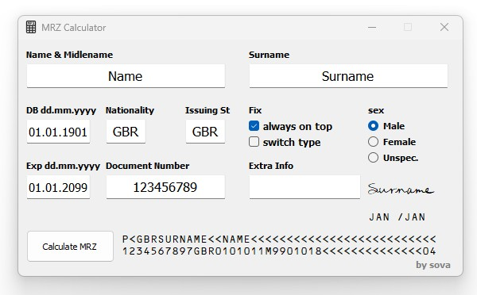
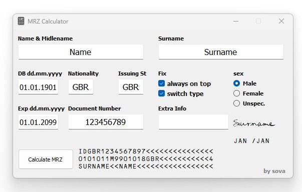

# MRZ_Calculator
simple MRZ code generator for passports &amp; ID's

# Requirements

OCR-B 10 BT font required for correct display of data

# Main:

# Example for passports:

# Example for ID's:

